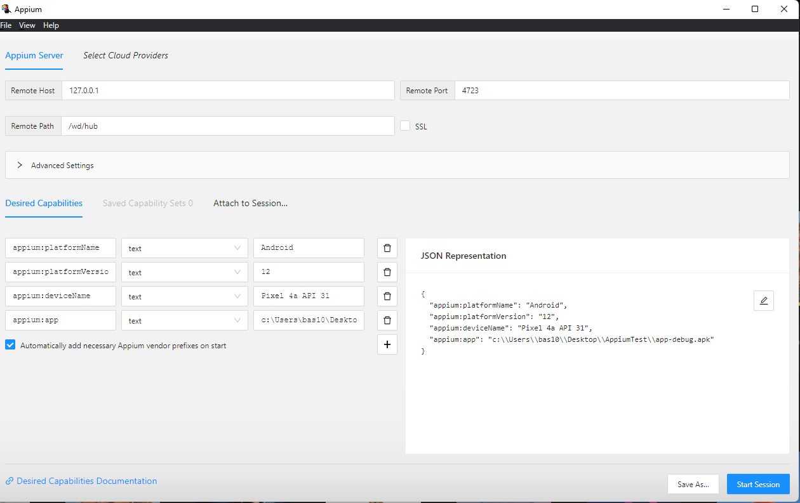
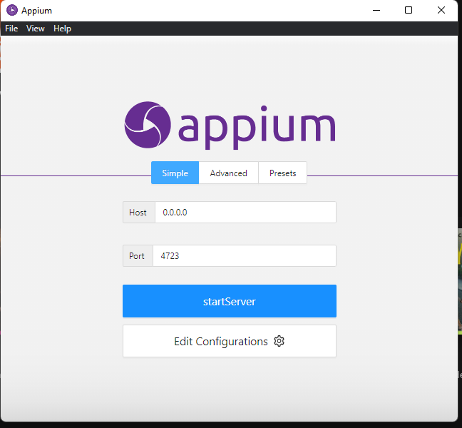
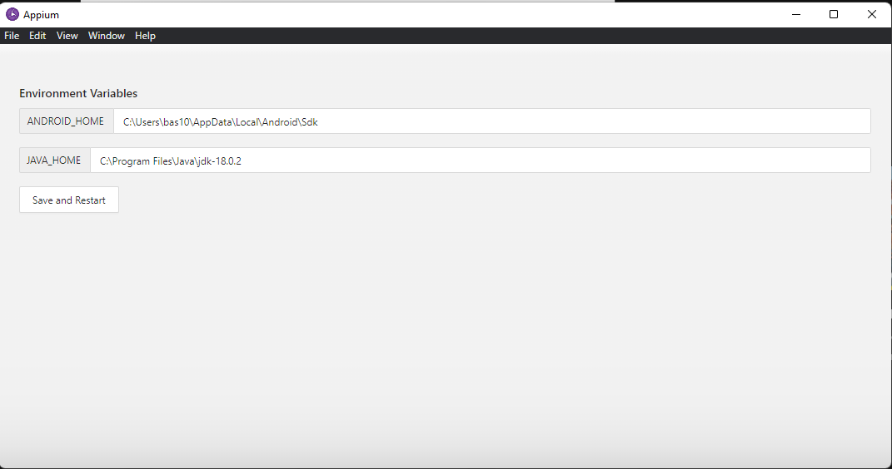

# Appium

- [Appium server](https://github.com/appium/appium-desktop/releases/tag/v1.22.3-4)
- [Appium with python setup](https://qxf2.com/blog/appium-mobile-automation/)
- [Appium python sdk](https://github.com/appium/python-client)
- [Appium python examples](https://github.com/appium/python-client/tree/master/test/functional/android)
- [Appium robotframework](https://github.com/serhatbolsu/robotframework-appiumlibrary)
- [Appium inspector](https://github.com/appium/appium-inspector/releases/tag/v2022.7.1)
- [Appium robotframework setup](https://www.linkedin.com/pulse/step-appium-automation-using-robot-framework-amr-khamis)
- [Android](https://developer.android.com/studio)
- [JDK](https://www.oracle.com/java/technologies/downloads/)
- [Appium robotframework Keywords Documentation](https://serhatbolsu.github.io/robotframework-appiumlibrary/AppiumLibrary.html)

apk path relative to project folder
`app\build\intermediates\apk\debug`

```powershell
python --version
pip --version

winget install python

pip install Appium-Python-Client

.\aapt.exe dump badging "C:\Users\bas10\AndroidStudioProjects\AppiumTestApp\app\build\intermediates\apk\debug\app-debug.apk"

pip install --upgrade robotframework-appiumlibrary
```

- package
- android:name





```powershell
appium -p 4723 -a 0.0.0.0 -pa /wd/hub --chromedriver-executable "C:\Users\bas10\Downloads\chromedriver.exe"
```

```powershell
# for test creation or debugging
emulator.exe -avd Pixel_4a_API_31

# Run the test as fast as possible
emulator.exe -avd Pixel_4a_API_31 -no-window
```

```robot
*** Variables ***
${REMOTE_URL}           http://localhost:4723/wd/hub
${PLATFORM_NAME}        Android
${PLATFORM_VERSION}     12.0
# ${DEVICE_NAME}          SM_G965F
${Activity_NAME}        com.example.appiumtestapp.MainActivity
${PACKAGE_NAME}         com.example.appiumtestapp

*** Keywords ***
Open start app
    Open Application    ${REMOTE_URL}
    ...                 platformName=${PLATFORM_NAME}
    ...                 platformVersion=${PLATFORM_VERSION}
    # ...                 deviceName=${DEVICE_NAME}
    ...                 udid=21a31fb0f90d7ece
    ...                 appWaitForLaunch=false
    ...                 app=C:\\Users\\bas10\\Desktop\\AppiumTest\\Tests\\app-debug.apk
    ...                 automationName=UiAutomator2
    ...                 newCommandTimeout=2500
    ...                 appActivity=${Activity_NAME}
    ...                 appPackage=${PACKAGE_NAME}
```
