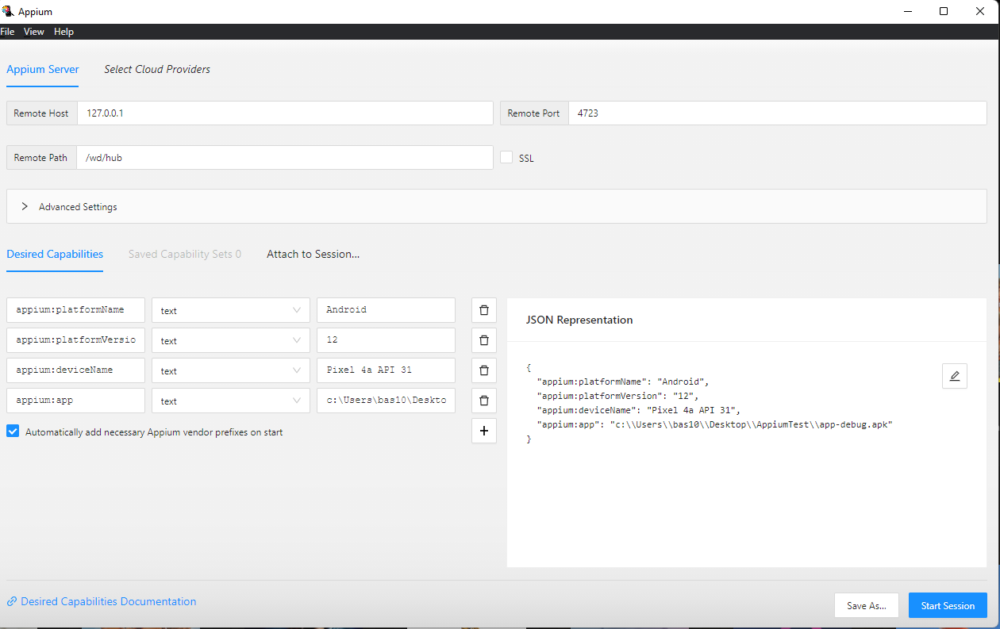
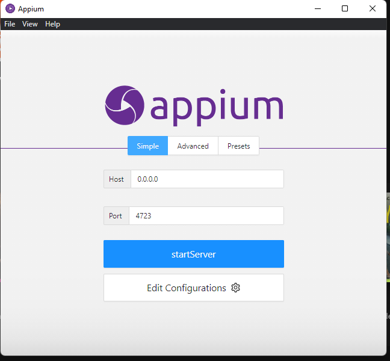

# Appium

[Appium server](https://github.com/appium/appium-desktop/releases/tag/v1.22.3-4)
[Appium with python setup](https://qxf2.com/blog/appium-mobile-automation/)
[Appium python sdk](https://github.com/appium/python-client)
[Appium python examples](https://github.com/appium/python-client/tree/master/test/functional/android)
[Appium robotframework](https://github.com/serhatbolsu/robotframework-appiumlibrary)
[Appium inspector](https://github.com/appium/appium-inspector/releases/tag/v2022.7.1)
[Appium robotframework setup](https://www.linkedin.com/pulse/step-appium-automation-using-robot-framework-amr-khamis)
[Android](https://developer.android.com/studio)
[JDK](https://www.oracle.com/java/technologies/downloads/)

apk path relative to project folder
`app\build\intermediates\apk\debug`

```powershell
python --version
pip --version

winget install python

pip install Appium-Python-Client

.\aapt.exe dump badging "C:\Users\bas10\AndroidStudioProjects\AppiumTestApp\app\build\intermediates\apk\debug\app-debug.apk"

pip install --upgrade robotframework-appiumlibrary
```

- package
- android:name





